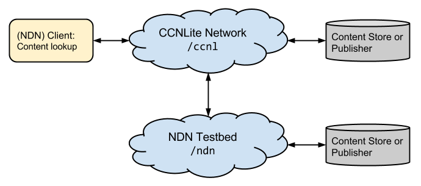
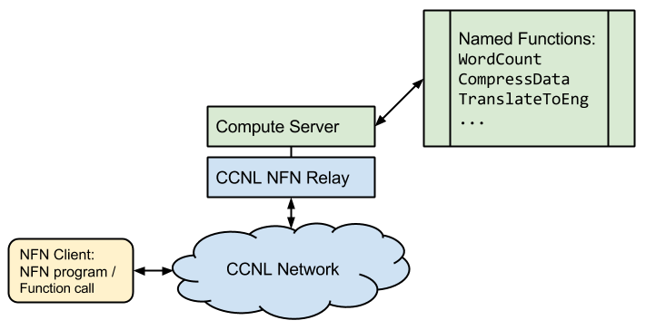
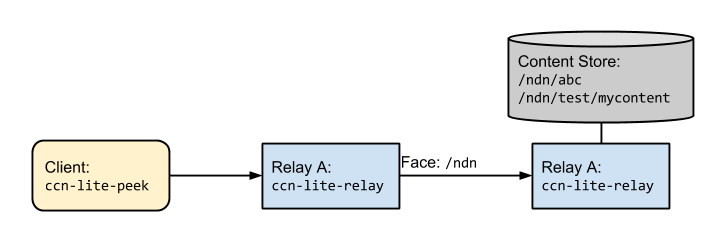
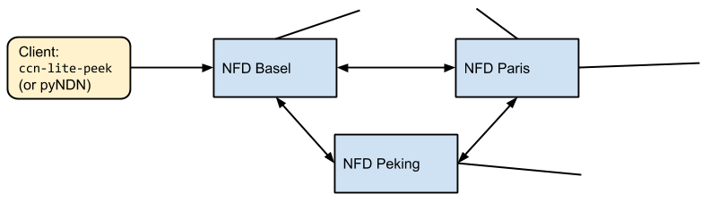
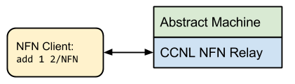
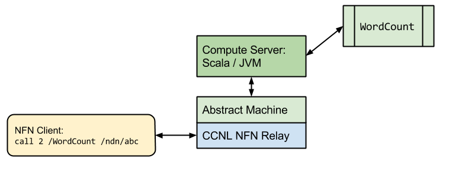

# CCN-Lite and NFN Tutorial

Table Of Contents:
- [Introduction](#introduction)
- [Scenario 1: Simple Content-lookup](#scenario1)
- [Scenario 2: Content Lookup from NDN Testbed](#scenario2)
- [Scenario 3: Connecting CCNL with NDNTestbed](#scenario3)
- [Scenario 4: Simple NFN request](#scenario4)
- [Scenario 5: NFN request with Compute Server Interaction](#scenario5)

<a name="introduction"/>
## Introduction

This Tutorial explains and demonstrates 5 scenarios for both CCN as well as NFN use cases. The first three scenarios demonstrate static content lookup in a CCN network. 



For static content lookup a client sends an interest network, consisting of heterogeneous CCN implementations. The interest will be fulfilled by either a content store within the network or a producer of content.

For CCN, there exist mainly three different implementations and packet formats. The original CCNb encoding and the currently evolving NDN and CCNx implementations. CCN-Lite is a lightweight, cross-compatible implementation of CCN. It is written in C and (optionally) runs in the kernel space.

Scenario 4 and 5 issue function calls to the network for  dynamic content creation in a NFN network.



These scenarios show both the extended CCN-Lite router with NFN capabilities to manipulate computation names as well as distribute computation and it shows the external compute environment which is responsible to carry out the actual computations.

<a name="scenario1"/>
## Scenario 1: Simple Content-lookup 

This scenario consists of a topology of two nodes `A` and `B` each running an instance of the CCN-Lite relay. The cache of relay `B` is populated with some content and a forwarding rule is setup from node `A` to node `B`. Interests are send to node `A`.

### 0. Installing CCN-Lite 

1. `git clone https://github.com/cn-uofbasel/ccn-lite`
2. Set the CCN-Lite env: `export CCNL_HOME=".../ccn-lite"` (don't forget to add it to your  bash profile if you want it to persist)
3. Dependencies:
	* Ubuntu: `sudo apt-get install libssl-dev`
	* OSX: `brew install openssl` (assuming the [homebrew](http://brew.sh) packet manager is installed)

4. `make clean all` in `$CCNL_HOME`

### 1. Producing Content 

`ccn-lite-mkC` creates an (unsigned) content object in a specified wireformat, subject to the maximum packet size of 4kB. CCN-Lite currently supports three wireformats. We use `ndn2013` in the following, `ccnb` and `ccnx2014` are also available. 

```bash
$CCNL_HOME/util/ccn-lite-mkC -s ndn2013 "/ndn/test/mycontent" > $CCNL_HOME/test/ndntlv/mycontent.ndntlv
```
Type something, your text will be used as the data for the content object.

### 2. Starting ccn-lite-relay `A`  

`ccn-lite-relay` is a ccn network router (or forwarder).

`-v` indicates the loglevel. 

`-u` sets the relay to listen on UDP port `9998`.

`-x` sets up a Unix socket, we will use that port later to send management commands. 

```bash
$CCNL_HOME/ccn-lite-relay -v 99 -s ndn2013 -u 9998 -x /tmp/mgmt-relay-a.sock
```

### 3. Starting ccn-lite-relay `B` 
Similar to starting relay `A`, but on a different port. Additional, with `-d` we add all content objects from a directory to the cache of the relay. Currently the relay expects all files to have the file extension `.ndntlv` (and `.ccntlv`/`.ccnb` respectively).
Open a new terminal window for relay `B`.

```bash
$CCNL_HOME/ccn-lite-relay -v 99 -s ndn2013 -u 9999 -x /tmp/mgmt-relay-b.sock -d $CCNL_HOME/test/ndntlv
```

### 4. Add a Forwarding Rule
The two relays are not yet connected to each other. We want to add a forwarding rule from node `A` to node `B` which is a mapping of a prefix to an outgoing face. Thus, we first need to create the face on relay `A` followed by defining the forwarding rule for `/ndn`.

`ccn-lite-ctrl` provides a set of management commands to configure and maintain a relay. These management commands are based on a request-reply protocol using interest and content objects. Currently the ctrl tool is hardwired for the `ccnb` format. 
To decode the reply of the ctrl tool we use the `ccn-lite-ccnb2xml` tool.

Finally, because faces are identified by dynamically asigned numbers,  we need to extract the FACEID from the reply of the create face command. When defining the forwarding rule we can refer to this FACEID. 

Again, open a new terminal window.
```bash
FACEID=`$CCNL_HOME/util/ccn-lite-ctrl -x /tmp/mgmt-relay-a.sock newUDPface any 127.0.0.1 9999 | $CCNL_HOME/util/ccn-lite-ccnb2xml | grep FACEID | sed -e 's/.*\([0-9][0-9]*\).*/\1/'`
```
Next, we need to define the namespace of the face. We choose `/ndn` because our test content as well as all objects in `./test/ndntlv` have a name starting with `/ndn`. Later, all interest which match with the longest prefix on this name will be forwarded to this face. Relay `A` is now connected to relay `B` but relay `B` does not have a forwarding rule to node `B` (`A ---> B`).
```bash
$CCNL_HOME/util/ccn-lite-ctrl -x /tmp/mgmt-relay-a.sock prefixreg /ndn $FACEID ndn2013 | $CCNL_HOME/util/ccn-lite-ccnb2xml 
```

### 5. Send Interest for Name `/ndn/test/mycontent/` to `A` 
The `ccn-lite-peek` utility encodes the specified name in a interest with the according suite and sends it to a socket. In this case we want it to send the interest to the the relay `A`. Relay `A` will receive the interest, forward it to node `B` which will in turn respond with our initially created content object to relay `A`. Relay `A` sends the content objects back to peek, which prints it to stdout. Here, we also pipe the output to `ccn-lite-pktdump` which detects the encoded format (here ndntlv) and prints the wireformat-encoded packet in a readable format.
```bash
$CCNL_HOME/util/ccn-lite-peek -s ndn2013 -u 127.0.0.1/9998 "/ndn/test/mycontent" | $CCNL_HOME/util/ccn-lite-pktdump
```

<a name="scenario2"/>
## Scenario 2: Content Lookup from NDN Testbed 


Similar to Scenario 1, but this time the network consists of the NDN Testbed instead of a set of CCN-Lite relays. 


Peek sends the interest directly to a node in the NDN Testbed. `-w` sets the timeout of peek to 10 seconds.

```bash
$CCNL_HOME/util/ccn-lite-peek -s ndn2013 -u 192.43.193.111/6363 -w 10 "/ndn/edu/ucla/ping" | $CCNL_HOME/util/ccn-lite-pktdump
```

Note: `/ndn/edu/ucla/ping` creates dynamically a new content packet with a limited lifetime and random name extension. Repeating the above command might return the cached copy instead of triggering a new response.

<a name="scenario3"/>
## Scenario 3: Connecting CCNL with NDNTestbed 


Scenario 3 combines Scenario 1 and 2 by connecting a (local) CCN-Lite relay to the NDNTestbed and sending interests to it. The relay will forward the interests to the testbed.


### 1. Shutdown relay `B` 
To shutdown a relay we can use the ctrl tool.
```bash
$CCNL_HOME/util/ccn-lite-ctrl -x /tmp/mgmt-relay-b.sock debug halt 
```

### 2. Remove Face to `B` 
To see the current configuration of the face, use:
```bash
$CCNL_HOME/util/ccn-lite-ctrl -x /tmp/mgmt-relay-a.sock debug dump | $CCNL_HOME/util/ccn-lite-ccnb2xml
```
Now we can destroy the face:
```bash
$CCNL_HOME/util/ccn-lite-ctrl -x /tmp/mgmt-relay-a.sock destroyface $FACEID | $CCNL_HOME/util/ccn-lite-ccnb2xml 
```
And check again if the face was actually removed.

### 3. Connecting `A` to Testbed 
Connect to the Testbed server of the University of Basel by creating a new UDP face to the NFD of Basel and then registring the prefix `/ndn`
```bash
$CCNL_HOME/util/ccn-lite-ctrl -x /tmp/mgmt-relay-a.sock newUDPface any 192.43.193.111 6363| $CCNL_HOME/util/ccn-lite-ccnb2xml
```

```bash
$CCNL_HOME/util/ccn-lite-ctrl -x /tmp/mgmt-relay-a.sock prefixreg /ndn FACEID ndn2013 | $CCNL_HOME/util/ccn-lite-ccnb2xml 
```

### 4. Send interest to `A` 
Request data from the Testbed system of the UCLA. The Interest will be transmitted over the Testbed server of the University of Basel to the Testbed system of the UCLA:
```bash
$CCNL_HOME/util/ccn-lite-peek -s ndn2013 -u 127.0.0.1/9998 -w 10 "/ndn/edu/ucla" | $CCNL_HOME/util/ccn-lite-pktdump
```


<a name="scenario4"/>
## Scenario 4: Simple NFN request 


This scenario consists of a single NFN node `A`. A user request the result of a simple built-in operation: `add 1 2`

### 1. Start a NFN-relay

To build CCN-lite with NFN, export the variable:
```bash
export USE_NFN=1
```
and rebuild the project
or build:

```bash
make ccn-nfn-relay
```

The ccn-nfn-relay can be started similar to the ccn-lite-relay:
```bash
$CCNL_HOME/ccn-nfn-relay -v 99 -u 9001 -x /tmp/mgmt-nfn-relay-a.sock
```

### 2. Send a NFN request

To send a NFN request, we can use the `ccn-lite-simplenfn` tool instead of `ccn-lite-peek`. This tool is very similar, but instead of fetching the content for a static name it returns the result of a dynamic NFN computation.
```bash
$CCNL_HOME/util/ccn-lite-simplenfn -s ndn2013 -u 127.0.0.1/9001 "add 1 2" | $CCNL_HOME/util/ccn-lite-pktdump
```

## Scenario 5: NFN request with Compute Server Interaction 

This scenario explains how to setup an NFN-node which can interact with an Compute Server. 
A compute server is an externel application which can execute functions written in a high level programming language.
Instead of a complex Compute Server a simple dummyserver is used in this scenario.
The function "/test/data" should be called.

### 1. Start a NFN-relay
A NFN-relay is started on the same way as shown in the previous scenario:
```bash
$CCNL_HOME/ccn-nfn-relay -v 99 -u 9001 -x /tmp/mgmt-nfn-relay-a.sock
```

### 2. Start the computation dummy server
The dummy server is written in python and can only handle the function "/test/data". 
Start it with:
```bash
python $CCNL_HOME/test/scripts/nfn/dummyanswer_ndn.py
```
For complexer functions you have to setup the nfn-scala computation environment.


### 3. Add a compute face
To interact with the Computation server which runs on Port 9002 it is required to setup a new interface.
```bash
$CCNL_HOME/util/ccn-lite-ctrl -x /tmp/mgmt-nfn-relay-a.sock newUDPface any 127.0.0.1 9002| $CCNL_HOME/util/ccn-lite-ccnb2xml
```
And to register the name "COMPUTE" to this interface. This name is reserved in NFN networks for the interaction with a Compute Server:
```bash
$CCNL_HOME/util/ccn-lite-ctrl -x /tmp/mgmt-nfn-relay-a.sock prefixreg /COMPUTE FACEID ndn2013 | $CCNL_HOME/util/ccn-lite-ccnb2xml 
```

### 4. Add dummy function to the cache of the relay
Add a dummy function to the cache of the relay to invoke the computatin locally:
```bash
$CCNL_HOME/util/ccn-lite-ctrl -x /tmp/mgmt-nfn-relay-a.sock addContentToCache $CCNL_HOME/test/ndntlv/nfn/computation_content.ndntlv  | $CCNL_HOME/util/ccn-lite-ccnb2xml
```

### 5. Send a request for a function call:
To invoke the function call the user can issue the request:
```bash
$CCNL_HOME/util/ccn-lite-simplenfn -s ndn2013 -u 127.0.0.1/9001 "call 1 /test/data" | $CCNL_HOME/util/ccn-lite-pktdump
```
The result of the computation is 10.

One can also combine build in operators and function calls:
```bash
$CCNL_HOME/util/ccn-lite-simplenfn -s ndn2013 -u 127.0.0.1/9001 "add 1 (call 1 /test/data)" | $CCNL_HOME/util/ccn-lite-pktdump
```
Now the result will be 11.


