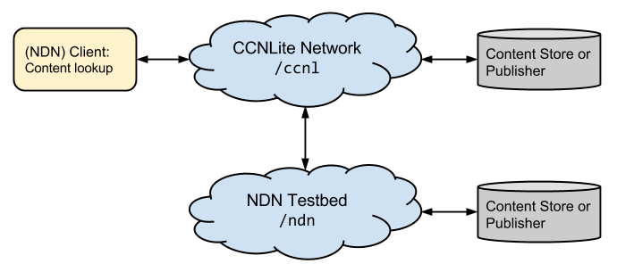
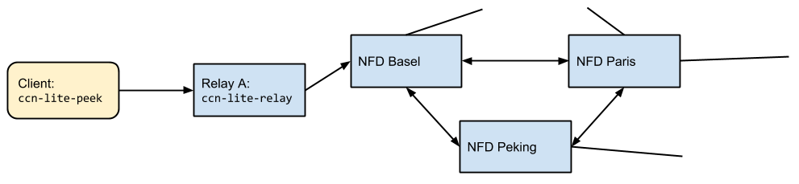
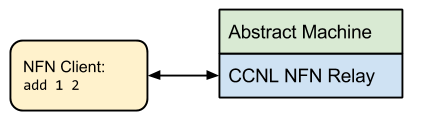

# CCN-lite and NFN Tutorial

## Table Of Contents:
- [Introduction](#introduction)
- [Scenario 1: Simple Content-lookup](#scenario1)
- [Scenario 2: Content Lookup from NDN Testbed](#scenario2)
- [Scenario 3: Connecting CCNL with NDN Testbed](#scenario3)
- [Scenario 4: Simple NFN request](#scenario4)
- [Scenario 5: Named Function Networking (NFN) demo](#scenario5)
- [Scenario 6: Creating and Publishing your own Named Function](#scenario6)


<a name="introduction"/>
## Introduction

This tutorial explains and demonstrates five scenarios for both
Content-Centric-Networking (CCN) as well as Named-Function-Networking (NFN) use
cases.

As of 2014, there exist mainly three different CCN implementations and packet
formats. a) The original CCNx software and its CCNb encoding, as well as the
currently evolving b) Named-Data Networking (NDN) software and c) the new
CCNx1.0 implementation.

CCN-lite is a forth implementation: It is a lightweight and cross-compatible
implementation of Content Centric Networking which "speaks" all three dialects.
It is written in pure C and (optionally) runs in the Linux kernel space.
Moreover, it contains an extension to CCN called Named-Function-Networking,
which is also covered in this tutorial.



The first three scenarios of this tutorial demonstrate static content
lookup in a CCN network. We let a client send interests into a network
that consists of heterogeneous CCN implementations (our CCN-lite as
well as the NDN testbed). The interest will be fulfilled by either a
content store within the network or a producer of content. Note that although
CCN-lite handles all packet formats, the client has to pick one format and can
only access content that is encoded (and made routable) in that chosen format.

Scenario 4 and 5 issue function calls to the network for dynamic
content creation in a NFN network. The chosen setup is shown below
where the NFN-enhanced CCN-lite router manipulates computation names
and distributes computations, for example to the external compute
environment which is responsible to carry out the actual computations.


<a name="scenario1"/>
## Scenario 1: Simple content-lookup


This scenario consists of a topology of two nodes `A` and `B` each running an
instance of the CCN-lite relay. The cache of relay `B` is populated with some
content and a forwarding rule is setup from node `A` to node `B`. Interests are
send to node `A`.


### 0. Installing CCN-lite

Install CCN-lite by following the [Unix readme](../doc/README-unix.md).


### 1. Producing content

`ccn-lite-mkC` creates an (unsigned) content object in a specified wire format,
subject to the maximum packet size of 4 KiB. `ccn-lite-mkC` currently supports
five wire formats. We use `ndn2013` in the following, `ccnb`, `ccnx2015`,
`cisco2015` and `iot2014` are also available. `ccn-lite-mkC` converts input from
stdin, so type something and press `Enter` after executing the following line:

```bash
$CCNL_HOME/bin/ccn-lite-mkC -s ndn2013 "/ndn/test/mycontent" > $CCNL_HOME/test/ndntlv/mycontent.ndntlv
```


### 2. Starting `ccn-lite-relay` for node `A`

`ccn-lite-relay` is a ccn network router (or forwarder). Type
`ccn-lite-relay -h` to see all available options. We will use the following:
* `-v` indicates the loglevel.
* `-u` sets the relay to listen on UDP port `9998`.
* `-x` sets up a Unix socket, we will use this socket to send management
  commands to the relay.

```bash
$CCNL_HOME/bin/ccn-lite-relay -v trace -s ndn2013 -u 9998 -x /tmp/mgmt-relay-a.sock
```


### 3. Starting `ccn-lite-relay` for node `B`

We start the relay for `B` similarly to relay `A` but on a different port.
Additional, with `-d` we add all content objects from a directory to the cache
of the relay. Currently the relay expects all files to have the file extension
`.ndntlv`, `.ccnb`, `.ccntlv`, `.cistlv` or `.iottlv` respectively.
Open a new terminal window for relay `B`:

```bash
$CCNL_HOME/bin/ccn-lite-relay -v trace -s ndn2013 -u 9999 -x /tmp/mgmt-relay-b.sock \
  -d $CCNL_HOME/test/ndntlv
```


### 4. Add a forwarding rule

The two relays are not yet connected to each other. We want to add a forwarding
rule from node `A` to node `B` which is a mapping of a prefix to an outgoing
face. Thus, we first need to create the face on relay `A` followed by defining
the forwarding rule for `/ndn`.

`ccn-lite-ctrl` provides a set of management commands to configure and maintain
a relay. These management commands are based on a request-reply protocol using
interest and content objects. Again, type `ccn-lite-ctrl -h` to see all
available options.

Currently the ctrl tool is hardwired for the `ccnb` format (but the relay still
handles packets in all other formats, too). To decode the reply of the ctrl tool
we use `ccn-lite-ccnb2xml`.

Finally, because faces are identified by dynamically assigned numbers, we need
to extract the `face id` from the reply of the `create face` command. When defining
the forwarding rule we can then refer to this `face id`.

For creating the face at node `A`, open a new terminal window:
```bash
FACEID=`$CCNL_HOME/bin/ccn-lite-ctrl -x /tmp/mgmt-relay-a.sock newUDPface any 127.0.0.1 9999 \
  | $CCNL_HOME/bin/ccn-lite-ccnb2xml | grep FACEID | sed -e 's/^[^0-9]*\([0-9]\+\).*/\1/'`
```
For defining the namespace that should become reachable through this face, we
have to configure a forwarding rule. We choose `/ndn` as namespace (prefix)
pattern because our test content as well as all objects in `./test/ndntlv` have
a name starting with `/ndn`. Later, all interest which match with the longest
prefix on this name will be forwarded to this face.

In other words: Relay `A` is technically connected to relay `B` through the UDP
face, but logically, relay `A` does not yet have the necessary forwarding state
to reach `B`. To create a forwarding rule (`/ndn ---> B`), we execute:
```bash
$CCNL_HOME/bin/ccn-lite-ctrl -x /tmp/mgmt-relay-a.sock prefixreg /ndn $FACEID ndn2013 \
  | $CCNL_HOME/bin/ccn-lite-ccnb2xml
```

You might want to verify a relay's configuration through the built-in HTTP
server. Just point your browser to `http://127.0.0.1:6363/`.

This ends the configuration part and we are ready to use the two-node setup for
experiments.


### 5. Send Interest for Name `/ndn/test/mycontent/` to `A`

The `ccn-lite-peek` utility encodes the specified name in a interest with the
according suite and sends it to a socket. In this case we want `ccn-lite-peek`
to send an interest to relay `A`. Relay `A` will receive the interest, forward
it to node `B` which will in turn respond with our initially created content
object to relay `A`. Relay `A` sends the content objects back to peek, which
prints it to stdout. Here, we pipe the output to `ccn-lite-pktdump` which
detects the encoded format (here `ndn2013`) and prints the wire format-encoded
packet in a somehow readable format.

```bash
$CCNL_HOME/bin/ccn-lite-peek -s ndn2013 -u 127.0.0.1/9998 "/ndn/test/mycontent" \
  | $CCNL_HOME/bin/ccn-lite-pktdump
```

If you want to see only the content use the `-f 2` output format option:
```bash
$CCNL_HOME/bin/ccn-lite-peek -s ndn2013 -u 127.0.0.1/9998 "/ndn/test/mycontent" \
  | $CCNL_HOME/bin/ccn-lite-pktdump -f 2
```


<a name="scenario2"/>
## Scenario 2: Content lookup from NDN Testbed


Similar to Scenario 1, but this time the network consists of the NDN Testbed
instead of a set of CCN-lite relays.

Peek sends the interest directly to a node in the NDN Testbed. `-w` sets the
timeout of peek to 10 seconds.

```bash
$CCNL_HOME/bin/ccn-lite-peek -s ndn2013 -u 192.43.193.111/6363 -w 10 "/ndn/edu/ucla/ping" \
  | $CCNL_HOME/bin/ccn-lite-pktdump
```

Note: `/ndn/edu/ucla/ping` dynamically creates a new content packet with a
limited lifetime and random name extension. Due to the network level caching,
repeating the above command might return a copy instead of triggering a new
response. Try it out!


<a name="scenario3"/>
## Scenario 3: Connecting a CCN-lite relay to the NDN Testbed



Scenario 3 combines Scenario 1 and 2 by connecting a (local) CCN-lite relay to
the NDN Testbed and sending interests to it. The relay will forward the
interests to the testbed.


### 1. Shutdown relay `B`

To properly shutdown a relay we can use `ccn-lite-ctrl`:
```bash
$CCNL_HOME/bin/ccn-lite-ctrl -x /tmp/mgmt-relay-b.sock debug halt | $CCNL_HOME/bin/ccn-lite-ccnb2xml
```


### 2. Remove face to `B`

To see the current configuration of the face, use:
```bash
$CCNL_HOME/bin/ccn-lite-ctrl -x /tmp/mgmt-relay-a.sock debug dump | $CCNL_HOME/bin/ccn-lite-ccnb2xml
```
Now we can destroy the face:
```bash
$CCNL_HOME/bin/ccn-lite-ctrl -x /tmp/mgmt-relay-a.sock destroyface $FACEID \
  | $CCNL_HOME/bin/ccn-lite-ccnb2xml
```

Check again if the face was actually removed.


### 3. Connecting node `A` directly to the NDN Testbed

Connect to the NDN testbed server of the University of Basel by creating a new
UDP face to the NFD of Basel and then registering the prefix `/ndn`:
```bash
FACEID=`$CCNL_HOME/bin/ccn-lite-ctrl -x /tmp/mgmt-relay-a.sock newUDPface any 192.43.193.111 6363 \
  | $CCNL_HOME/bin/ccn-lite-ccnb2xml | grep FACEID | sed -e 's/^[^0-9]*\([0-9]\+\).*/\1/'`
```

```bash
$CCNL_HOME/bin/ccn-lite-ctrl -x /tmp/mgmt-relay-a.sock prefixreg /ndn $FACEID ndn2013 \
  | $CCNL_HOME/bin/ccn-lite-ccnb2xml
```


### 4. Send interest to `A`

Request data from the Testbed system of the UCLA. The interest will be
transmitted over the Testbed server of the University of Basel to the Testbed
system of the UCLA:
```bash
$CCNL_HOME/bin/ccn-lite-peek -s ndn2013 -u 127.0.0.1/9998 -w 10 "/ndn/edu/ucla" \
  | $CCNL_HOME/bin/ccn-lite-pktdump
```


<a name="scenario4"/>
## Scenario 4: simple Named Function Networking (NFN) demo



This scenario consists of a single NFN node `A`. In this demo, we will request
the network to execute a simple built-in operation: `add 1 2`. A slightly more
complex numeric expression is also shown.


### 1. Start a NFN-relay

To build a CCN-lite relay with NFN functionality, export the variable and rebuild the project:
```bash
cd $CCNL_HOME/src
export USE_NFN=1
make
```

or build it directly:
```bash
cd $CCNL_HOME/src
make ccn-nfn-relay
```

The `ccn-nfn-relay` can be started similar to the ccn-lite-relay:
```bash
$CCNL_HOME/bin/ccn-nfn-relay -v trace -u 9001 -x /tmp/mgmt-nfn-relay-a.sock
```


### 2. Send a NFN request

To send a NFN request, we can use the `ccn-lite-simplenfn` tool instead of
`ccn-lite-peek`. This tool is very similar, but instead of fetching the content
for a static name it returns the result of a dynamic NFN computation.
```bash
$CCNL_HOME/bin/ccn-lite-simplenfn -s ndn2013 -u 127.0.0.1/9001 "add 1 2" \
  | $CCNL_HOME/bin/ccn-lite-pktdump -f 3
```
Try out more complex expression evaluations, for example `mult 23 (add 4 456)`.


<a name="scenario5"/>
## Scenario 5: Named Function Networking (NFN) demo

In this scenario we run a full implementation of the compute server:
[NFN-scala](https://github.com/cn-uofbasel/nfn-scala). A precompiled binary is
available in the release downloads of [release v0.1.0 of nfn-scala](https://github.com/cn-uofbasel/nfn-scala/releases/tag/v0.1.0).


### 0. Prerequisites

In order to run the compute server, Java needs to be installed:

- Ubuntu: `sudo apt-get install openjdk-7-jre`
- OS X: Java 7 should already be available. If not, download and install directly from [Oracle](http://java.com/).

Additionally, the Java binary is also needed:

```bash
wget https://github.com/cn-uofbasel/nfn-scala/releases/download/v0.1.0/nfn.jar
```


### 1. Start a NFN-relay

Start a `ccn-nfn-relay`. We again add the content you produced in the first
scenario.
```bash
$CCNL_HOME/bin/ccn-nfn-relay -v trace -u 9001 -x /tmp/mgmt-nfn-relay-a.sock -d $CCNL_HOME/test/ndntlv
```


### 2. Start the Scala compute server

Start the compute server with:

```bash
java -jar nfn.jar --mgmtsocket /tmp/mgmt-nfn-relay-a.sock \
  --ccnl-port 9001 --cs-port 9002 --debug --ccnl-already-running /node/nodeA
```

There is quite a lot going on when starting the compute server. Since the
application has the name of the management socket, it is able to setup the
required face: a UDP face from the relay on 9001 named `/COMPUTE` to the compute
server on 9002. It then publishes some data by injecting it directly into the
cache of CCN-lite. There are two documents named `/node/nodeA/docs/tiny_md`
(single content object) and `/node/nodeA/docs/tutorial_md` (several chunks).
There are also two named functions (or services) published:
`/node/nodeA/nfn_service_WordCount` and `/node/nodaA/nfn_service_Pandoc`. We
explain later how they can be used.


### 3. Send a NFN expression with a word count function call

We are going to invoke the `WordCount` service. This function takes a variable
number of arguments of any type (string, integer, name, another call
expression, ...) and returns an integer with the number of words:

```
call 3 /ndn/ch/unibas/nfn/nfn_service_WordCount /name/of/doc 'foo bar'
```

To invoke this service over NFN we send the following NFN expression to the
relay `A`:

```bash
$CCNL_HOME/bin/ccn-lite-simplenfn -s ndn2013 -u 127.0.0.1/9001 -w 10 \
  "call 2 /node/nodeA/nfn_service_WordCount 'foo bar'" | $CCNL_HOME/bin/ccn-lite-pktdump
```

The result of this request should be `2`.

You can also count the number of words of the document `/ndn/test/mycontent`
that you produced in the first scenario:

```bash
$CCNL_HOME/bin/ccn-lite-simplenfn -s ndn2013 -u 127.0.0.1/9001 -w 10 \
  "call 2 /node/nodeA/nfn_service_WordCount /ndn/test/mycontent" | $CCNL_HOME/bin/ccn-lite-pktdump
```

Below are more examples that include counting `tiny_md` and combine `WordCount`
with `add`:

```bash
$CCNL_HOME/bin/ccn-lite-simplenfn -s ndn2013 -u 127.0.0.1/9001 -w 10 \
  "call 2 /node/nodeA/nfn_service_WordCount /node/nodeA/docs/tiny_md" | $CCNL_HOME/bin/ccn-lite-pktdump
```
```bash
$CCNL_HOME/bin/ccn-lite-simplenfn -s ndn2013 -u 127.0.0.1/9001 -w 10 \
  "call 3 /node/nodeA/nfn_service_WordCount 'foo bar' /node/nodeA/docs/tiny_md" \
  | $CCNL_HOME/bin/ccn-lite-pktdump
```
```bash
$CCNL_HOME/bin/ccn-lite-simplenfn -s ndn2013 -u 127.0.0.1/9001 -w 10 \
  "add (call 2 /node/nodeA/nfn_service_WordCount 'foo bar') 40" | $CCNL_HOME/bin/ccn-lite-pktdump
```


### 4. Invoke the pandoc service

The example compute server also includes the [Pandoc](http://johnmacfarlane.net/pandoc)
service. To make use of it, you have to install Pandoc itself:
* Ubuntu: `sudo apt-get install pandoc`
* OS X: `brew install pandoc`

This function reformats a document from one format (e.g. GitHub flavored Markdown) to
another format (e.g. HTML) using Pandoc. It takes 3 parameters:
* the document to transform,
* the initial document format and
* the target format.

In NFN, this could look like this:
```
call 4 /ndn/ch/unibas/nfn/nfn_service_Pandoc /doc/mydocument 'markdown' 'latex'
```

A list of all supported formats can be found on the [Pandoc homepage](http://johnmacfarlane.net/pandoc).

To invoke the Pandoc sevice in our NFN network, type:
```bash
$CCNL_HOME/bin/ccn-lite-simplenfn -s ndn2013 -u 127.0.0.1/9001 -w 10 \
  "call 4 /node/nodeA/nfn_service_Pandoc /node/nodeA/docs/tiny_md 'markdown_github' 'html'" \
  | $CCNL_HOME/bin/ccn-lite-pktdump -f 2
```

Since `tiny_md` is only a small document, the generated HTML document will also
fit into a single content object.


### 5. Invoke the pandoc service with a large document

So far, all results of NFN computations were small and fit into single content
objects. Next we test what happens if the result is larger by transforming `tutorial_md`:

```bash
$CCNL_HOME/bin/ccn-lite-simplenfn -s ndn2013 -u 127.0.0.1/9001 -w 10 \
  "call 4 /node/nodeA/nfn_service_Pandoc /node/nodeA/docs/tutorial_md 'markdown_github' 'html'" \
  | $CCNL_HOME/bin/ccn-lite-pktdump -f 3
```

The result of this computation will not be a document, but a redirect name in
the form of `redirect:/node/nodeA/call 2 %2fndn%2fch...`. When the result is too
large to fit into one content object it has to be chunked. Since chunking of
computation does not make too much sense, the result is a redirect address under
which the chunked result was published by the compute server. Note that in the
redirect name slashes `/` have to be escaped as `%2f` in order to avoid that the
components are being split up.

To get the result, we have to use `ccn-lite-fetch` because `ccn-lite-peek` can
only retrieve a single content object. `ccn-lite-fetch` returns a stream of data
of the fetched content object chunks instead of wire format encoded packets.
Therefore `ccn-lite-pktdump` is not necessary.

Call `ccn-lite-fetch` with the redirect name without the prefix `redirect:`:
```bash
$CCNL_HOME/bin/ccn-lite-fetch -s ndn2013 -u 127.0.0.1/9001 \
  "/node/nodeA/call 4 %2fnode%2fnodeA%2fnfn_service_Pandoc %2fnode%2fnodeA%2fdocs%2ftutorial_md 'markdown_github' 'html'" \
  > tutorial.html
```

Open the `tutorial.html` file in the browser - it is the HTML page of this
tutorial without pictures.


### 6. Function chaining

One last example shows the chaining of functions. For example, we can convert
`tutorial_md` into HTML and count the number of words of the result:

```bash
$CCNL_HOME/bin/ccn-lite-simplenfn -s ndn2013 -u 127.0.0.1/9001 -w 10 \
  "call 2 /node/nodeA/nfn_service_WordCount (call 4 /node/nodeA/nfn_service_Pandoc \
  /node/nodeA/docs/tutorial_md 'markdown_github' 'html')" | $CCNL_HOME/bin/ccn-lite-pktdump
```


<a name="scenario6"/>
## Scenario 6: Creating and Publishing your own Named Function

So far, we have been using a binary of the compute server with predefined
services. In this scenario, we are first going to look at the compute server
start script as well as how an implemented service looks like. Then, we are
going to implement a new service called `revert`.


### 0. Installing NFN-scala

Follow the installation instructions of [nfn-scala](https://github.com/cn-uofbasel/nfn-scala).


### 1. Compile and start the Scala compute server

To run the Scala compute server from source, call `sbt` with `runnables.production.ComputeServerStarter`:

```bash
sbt 'runMain runnables.production.ComputeServerStarter --mgmtsocket /tmp/mgmt-nfn-relay-a.sock \
  --ccnl-port 9001 --cs-port 9002 --debug --ccnl-already-running /node/nodeA'
```


### 2. Explaining StandaloneComputeServer

Currently all running targets exist within the project itself in the `runnables`
package. We will only discuss `StandaloneComputeServer` found in `src/main/scala/runnables/production`.
You might be able to understand what is going on even if you do not know any
Scala. First, there is some basic parsing of the command-line arguments. The
important part are the following lines:

```scala
// Configuration of the router, so far always ccn-lite
// It requires the socket to the management interface
// "isCCNOnly = false" indicates that it is a NFN node
// "isAlreadyRunning = true" tells the system that it should not have to start ccn-lite
val routerConfig = RouterConfig(config.ccnLiteAddr,
                                config.ccnlPort,
                                config.prefix,
                                config.mgmtSocket.getOrElse(""),
                                isCCNOnly = false,
                                isAlreadyRunning = config.isCCNLiteAlreadyRunning)

// This configuration sets up the compute server
// "withLocalAm" indicates whether it should start an abstract machine alongside the compute server
val computeNodeConfig = ComputeNodeConfig("127.0.0.1",
                                          config.computeServerPort,
                                          config.prefix,
                                          withLocalAM = false)

// Abstraction of a node which runs both the router and the compute server on localhost over UDP
val node = LocalNode(routerConfig, Some(computeNodeConfig))

// Publish services
// This will internally get the Java bytecode for the compiled services,
// put them into jar files and put the data of the jar into a content object.
// The name of this service is inferred from the package structure of the service
// as well as the prefix of the local node.
// In this case the prefix is given with the command line argument 'prefixStr'
// (e.g. /node/nodeA/nfn_service_WordCount)
node.publishServiceLocalPrefix(new WordCount())
node.publishServiceLocalPrefix(new Pandoc())
node.publishServiceLocalPrefix(new PDFLatex())
node.publishServiceLocalPrefix(new Reverse())

// Publishes the content of the CCN-lite tutorial
node += PandocTestDocuments.tutorialMd(node.localPrefix)
// Publishes a very small two-line markdown file
node += PandocTestDocuments.tinyMd(node.localPrefix)
```


### 3. Introduction to service implementation

We now take a closer look to an exemplary service implementation that reverses
a given `String`, found in `/src/main/scala/nfn/service/Reverse.scala`.
You should be able to grasp what it does even without knowing Scala.

```scala
package nfn.service

// ActorRef is the reference to an Akka Actor where you can send messages to
// It is used to have access to the client-library style interface to CCN where
// you can send interests to and receive content from. Additionally it is used
// to access the management interface and more.
// This service import is required for the signature function. However, it does not use it.
import akka.actor.ActorRef

// NFNService is a trait, which is very similar to a Java interface
// It requires the implementation of one method called 'function'
class Reverse extends NFNService {

  // This method has two parameters:
  //   args: a list of NFNValues
  //   ccnApi: a reference to the actor providing the CCN interface
  // It returns a NFNValue.
  override def function(args: Seq[NFNValue], ccnApi: ActorRef): NFNValue = {

    // Match the arguments to the expected or supported types
    // It is only implemented on a list with exactly one parameter of type string ('foo bar')
    args match {
      case Seq(NFNStringValue(str)) =>

        // Return a NFNStringValue, a sub-type of NFNValue
        // NFNValue is a trait with a 'toDataRepresentation', which will be called on the result of the
        // function invocation to get the result to put into the final content object
        NFNStringValue(str.reverse)

      // ??? is a Scala construct, it throws a NotImplementedExeption
      case _ => ???
    }
  }
}
```

In the following is a more complete implementation of `WordCount`, demonstrating
how several arguments and different argument types can be handled:

```scala
package nfn.service

import akka.actor.ActorRef

class WordCount() extends NFNService {
  override def function(args: Seq[NFNValue], ccnApi: ActorRef): NFNValue = {
    def splitCount(s: String) = s.split(" ").size

    NFNIntValue(
      args.map({
        // Corresponds to a name or another expression in the call expression
        // The compute server will fetch the data from the network before invoking this function
        case doc: NFNContentObjectValue => splitCount(new String(doc.data))
        case NFNStringValue(s) => splitCount(s)
        case NFNIntValue(i) => 1
        case _ => {
          val str = s"$ccnName can only be applied to values of type NFNBinaryDataValue and not $args"
          throw new NFNServiceArgumentException(str)
        }
      }).sum
    )
  }
}
```


### 4. Implementing and publishing a custom service

If you want to use an IDE (e.g. IntelliJ IDEA or Eclipse with Scala plugin) you
can generate a fully fledged project by invoking sbt: `sbt gen-idea` or `sbt eclipse`.

Create a `.scala` file in the service folder `src/main/scala/nfn/service` in the
package `nfn.service`. An example is to implment an service that converts all
characters to upper case, e.g. `ToUpper.scala`. Implement your service
accordingly - a Scala String has the function `.toUpperCase`. It is up to you on
what types the service is defined and how many arguments the service supports.

To publish this service, simply add the line `node.publishServiceLocalPrefix(new ToUpper())`
to the `StandaloneComputeServer`. If you used the above mention package, you do
not have to import anything. If you choose a different place you need to import
the class accordingly.


### 5. Test your service

After rerunning both the `ccn-nfn-relay` as well as the compute server, you
should be able to call your service. Run the according peek with the name of
your service being `/node/nodeA/nfn_service_ToUpper`. If you have chosen a
different package, replace every `.` of the package name with `_`,
e.g. `/node/nodeA/my_package_ToUpper`.

Optionally you can send us a [pull request](https://github.com/cn-uofbasel/ccn-lite/pulls)
or an email with the code of your service and we will publish it to the testbed.


### 6. Uninstall sbt and downloaded libraries
Use the following to uninstall NFN-scala and its dependencies:
* Delete the local NFN-scala repository
* Uninstall sbt (and remove `~/.sbt` if it still exists)
* Remove `~/.ivy2` (this will of course also delete all your cached Java jars if you are using ivy)
